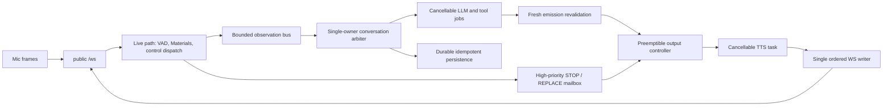

# GPT-Live の継続的音声対話から Tomoko が学べること

- 分析日: 2026-08-12
- 参照記事: [6 か月で構築した、応答性の高い音声 AI 向けリアルタイムシステム](https://openai.com/ja-JP/index/continuous-voice-interaction-with-gpt-live/)
- 記事公開日: 2026-08-03
- 対象: 現行 Tomoko（`PLAN.md` の Phase S23 まで完了した状態）

## この文書の読み方

この文書では、次の三つを分けて扱う。

- **記事の事実**: OpenAI の記事に明記されている内容
- **現状分析**: 現行 Tomoko のコードと記録から確認できた内容
- **提案**: 記事の原則を Tomoko の制約へ適用した設計案。まだ確定判断ではない

以下の PLAN は既存 `PLAN.md` を置き換えるものではない。実装に着手するときは、Phase ごとにテストを先に書き、設計判断を確定してから既存 `PLAN.md` へ追記する。

## 結論

GPT-Live 記事から最も参考にすべき原則は、特定のモデル、Go、WebRTC ではない。記事の主旨を日本語で要約すると、**「音声を流し続け、遅い仕事は音声経路を止めない」**ことである。

Tomoko はすでに、外部 `/ws` 一本、hot-path と tomoko-process の分離、partial/final、`TurnMaterials -> Pressures -> Gates`、相づち、`replace/append/stop`、非同期 sense、セッションと記憶という主要部品を持っている。そのため全面再設計や GPT-Live API への置換は必要ない。

一方、現在の実装は **ASR -> text LLM -> TTS のカスケード型**であり、GPT-Live の end-to-end 音声モデルではない。また、マイク受信は継続できても、LLM/TTS 実行中に新しい観測から判断を更新し、古い生成を即時停止する制御経路はまだ十分に証明されていない。

したがって優先順位は次の通りとする。

1. `first audio` を「相づち」と「意味のある回答」に分け、現在の既定構成を再計測する
2. TTS 生成中の STOP/REPLACE を含む真の preemption 回帰テストを作る
3. LLM、DB、TTS 中も新しい観測と取消を処理できる制御線にする
4. 発話直前に最新 Materials で再判断し、古くなった回答を声に出さない
5. その後に warm-up、active context compaction、shadow/soak を進める

## 記事から抽出できる設計原則

### 1. ターン待ちではなく、連続する音声を中心にする

記事では、カスケード型の ASR -> LLM -> TTS は各処理が直列に走るため遅延が加算され、声の調子や間などの手掛かりも失うと説明している。その後の speech-to-speech model は音声を直接処理することでこの問題を改善したが、推論開始を turn detector の判断に依存していたため、会話自体は依然として turn-based だった。GPT-Live は full-duplex 音声モデルが聞くことと話すことを同時に行い、独立した turn detector を音声経路から除いている。

重要なのは「発話終了まで何もしない」構造を避けることである。深い推論やツール利用は、会話を続けるモデルから非同期に委任される。

現行 Tomoko では VAD が発話境界と制御信号を担っているため、GPT-Live 記事だけを根拠に撤去することはできない。採用すべきなのは、**VAD を残したまま、入力継続、早期 feedback、訂正、取消を可能にすること**である。

### 2. media fast path をアプリケーション処理から隔離する

記事では、クライアントと音声モデルの間に専用の media fast path を置き、delegation、tool use、その他の application work を非同期 RPC 境界の後ろへ移している。conversation persistence も live path の外で行う。遅い処理は自分の結果だけを遅らせ、音声フレームの配送を止めない。

OpenAI は、従来の Python `asyncio` 実装だった media frontend と inference logic を Go で書き直した結果、frame delivery の滑らかさが改善し、新システムの p95 が旧システムの p50 相当になったと報告している。ただし、記事には指標の単位、絶対時間、負荷条件がなく、言語変更だけの因果効果も分離されていない。この結果だけを Tomoko の Go 化の根拠にはできない。

Tomoko では public endpoint を増やさず、既存 `/ws` の内側で live path と slow job を明確に分けるのが対応策になる。

### 3. 配送の揺らぎも会話品質である

記事では WebRTC が packet loss、clock drift、接続変化を吸収し、遅れた音声を一時的に伸縮して gap を防ぐとしている。また WARP が media/data startup を 6 network round trips から 1 round trip に減らしたとしている。Instant Connect は SDP signaling exchange を critical path から外す。両者を組み合わせることで、client は最初の単一 UDP packet から session を開始できる。

これは遠隔・大規模サービス向けの結果であり、localhost・一人用の Tomoko に WebRTC/WARP を直ちに導入する根拠にはならない。ただし、平均 end-to-end latency だけでなく、frame gap、jitter、queue wait、client が実際に再生した時刻を測るべきだという原則はそのまま適用できる。

### 4. 会話と深い思考を別の時間軸で動かす

GPT-Live では、音声モデルが会話を保ちながら、必要な検索・推論・ツール処理を別モデルへ委任する。委任の latency budget には routing、prompt 処理、推論、tool call、モデルとツールの往復すべてが含まれる。

記事では、音声モデルが frontier model の推論や tool use の間、短時間は会話をつなげられる一方、任意に遅い結果まで隠すことはできないと説明している。

Tomoko への適用では、相づちを待ち時間中の feedback として使える。ただし非同期結果には deadline、freshness、取消条件を持たせ、話題が変わった後の結果を発話しない契約が必要になる。

Tomoko にはすでに `sense_request -> info worker -> followup SpeechOrder` がある。新しい仕組みを増やすより、既存経路に期限、origin trace、supersede、送出直前の再評価を追加するのが自然である。

### 5. session warm-up、session affinity、prompt caching を latency budget に含める

記事では、音声セッション開始時に委任先モデルと tool を準備し、初期 context を prefill する。セッション中は同じ推論セッションへの affinity と prompt caching を使い、reasoning effort、出力量、tool schema、tool 往復数も調整する。

Tomoko では STT warm-up と安定した prompt prefix の工夫があるが、`prompt_cache_shape` の計測は実際の KV cache hit や backend affinity の証明ではない。cold/warm を分け、backend が本当に提供する機能だけを利用する必要がある。

### 6. 更新可能な live view と確定記録を分ける

記事では continuous audio から離散的 message を作るため、partial transcript と timing を使う。最新 message の text、timing、speaker は信頼できるまで変更可能であり、UI 向けの speculative view と分析向けの authoritative record を分けている。

Tomoko には partial/final reconciliation がすでにある。ここで新しい「暫定状態機械」を人格判断の中心に追加する必要はない。次の二つの read model として契約を明示すればよい。

- **live view**: 同じ発話 ID の revision を更新できる。表示、早期 feedback、割り込み判断用
- **canonical record**: final user utterance と実際に送出された substantive assistant utterance。記憶、要約、分析用

固定相づちや取り消された候補は emission audit には残せるが、独立した canonical assistant utterance として記憶へ混入させない。

### 7. 長時間 session の状態を、止めずに切り替える

記事では、現在の stateful model instance を動かしたまま代替 instance を準備し、context を prefill し、準備完了後に切り替える。context compaction も KV cache を無効化するため、live path 外で新しい context を作り、準備後に切り替える。

Tomoko への移植対象は「巨大モデルを二重常駐させること」ではなく、**派生 context を versioned snapshot として作り、request 境界で atomic に切り替えること**である。canonical utterance は変更・削除しない。

### 8. 短い benchmark ではなく、shadow と long-session で検証する

OpenAI は新経路を本番 traffic へ read-only で接続する silent/shadow test を段階的に行った。capacity を GPU throughput だけでは評価できず、CPU-side stream handler、queue、network path も同時にスケールさせる必要があると確認した。本番負荷では、記事中で特定されていない supporting component が負荷試験の予測より早く飽和し、inference request の滞留と遅延の連鎖を起こした。さらに、長時間 session の memory/persistence pressure、reconnect 時の compaction/restore、通常切断の shutdown race、集約値に隠れた instance 異常、config drift が検証対象になった。

一人用 Tomoko では本番 traffic の規模を模倣する必要はない。しかし、録音 replay を使った副作用なし比較、60 分以上の session、再接続、slow worker、通常切断、queue 飽和を含む soak は有効である。

## 記事の数値をそのまま外挿しない

| 記事の記述 | Tomoko での扱い |
|---|---|
| frame delivery について新システムの p95 が旧システムの p50 相当 | 指標定義、絶対値、条件がなく、Go 単独の効果とも断定できない。event-loop lag と frame jitter がボトルネックだと実測されるまで言語移行しない |
| WARP が media/data startup を 6 RTT から 1 RTT へ短縮 | WARP 固有。Instant Connect は別途 SDP exchange を critical path から外す。localhost の単一 WebSocket には直接適用しない |
| sub-second の応答感 | 記事に Tomoko と比較可能な測定定義はない。既存 800 ms 目標の代わりにはしない |
| 6 か月で構築 | 開発期間であり、性能指標や Tomoko の工数見積りではない |

## 現行 Tomoko との対応

| GPT-Live の概念 | 現行 Tomoko | 評価 |
|---|---|---|
| 外部 media path | public `/ws` 一本で mic/audio/event を処理 | 採用済み |
| media と人格・判断の分離 | `server/hot_path` と `server/tomoko`、内部 WS | 採用済み |
| 継続入力 | Tomoko 発話中も mic receive loop を継続 | 採用済み |
| partial/final | `AudioPartialLane`、`AudioFinalLane`、final reconciliation | 採用済み。identity/revision 契約は強化余地あり |
| 会話 floor の知覚 | `TurnMaterials`、MaAI/VAP、`p_yielding`、silence、playback | 採用済み。ただし playback の実耳時刻に差がある |
| 生成と送出の分離 | `LlmFireGate` と `SpeechEmissionGate` | 採用済み。ただし送出時 snapshot が古くなり得る |
| 発話の訂正・停止 | `replace_current`、`append_after_current`、`stop` と generation guard | 採用済み。ただし voice-derived preemption は未証明 |
| 深い処理の委任 | background sense と followup order | 採用済み。deadline/freshness を追加したい |
| prompt cache | stable prefix と cache shape instrumentation | 一部採用。実 cache hit/affinity は未証明 |
| active context compaction | closed session summary と context snapshot | 原本と索引の土台あり。active-session atomic cutover は未実装 |
| shadow/soak | scenario replay、autopilot | 土台あり。read-only shadow と長時間 lifecycle は不足 |
| full-duplex speech model | ASR -> text LLM -> VOICEVOX | 非該当。体験上の連続性を制御層で作っている |

主な実装根拠:

- public `/ws` と receive loop: `server/hot_path/app.py:80-230`
- partial/final lane: `server/hot_path/app.py:301-423`
- `TurnMaterials` latest-wins queue: `server/hot_path/turn_materials.py:127-151`
- internal WS control: `server/hot_path/ws_control.py`
- Tomoko realtime loop: `server/tomoko/realtime.py:85-308`
- 二段 gate: `server/tomoko/gates.py:36-172`
- speech order executor: `server/hot_path/speech_executor.py:42-136`
- stable prompt prefix と cache shape: `server/tomoko/prompt.py:44-78,171-195`
- closed-session summary: `server/summary/main.py:22-31`
- bounded recent history: `server/tomoko/conversation.py:642,690-695`
- WhisperKit simulated streaming: `server/audio/stt.py:440`、`LOG.md:3463`
- 既定 STT 変更前の latency artifact: `_docs/latency.md:214`

## 現状で優先して解くべき gap

### Gap 1: LLM 中に制御 request が直列化される

`RemoteTomokoWsCore` は observation の request/response を単一 lock で直列化する。Tomoko 側の `hot_path_realtime()` も `conversation_core.handle_observation()` を await し、その後の永続化まで終えてから acknowledgement/order を返す。

音声 receive loop と別の `TurnMaterials` 接続は動き続けるが、進行中 LLM を新しい partial で cancel/supersede する制御経路や、DB 遅延から order delivery を隔離する契約は未証明である。

これは記事の「slow work must not block voice」から最も直接的に導ける改善点である。

### Gap 2: SpeechEmissionGate が LLM 前の Materials を再利用する

`TomokoConversationCore.handle_observation()` は LLM 起動前に `turn_materials` を取得する（`server/tomoko/conversation.py:621`）。LLM の最初の文を待った後も、同じ snapshot と pressures を emission gate へ渡す（同 `:926-934`）。

この間にユーザーが話し始めても、最新 Materials 自体は別接続で更新される一方、進行中判断のローカル snapshot は古いままである。発話直前に次を行う必要がある。

1. 最新 Materials を再取得する
2. snapshot age と generation を確認する
3. 送出に関係する pressures と `SpeechEmissionGate` を再計算する
4. 古い候補を suppress/cancel/replace する

### Gap 3: voice-derived STOP/REPLACE が進行中 TTS へ届かない

result sender は一件ずつ `_send_audio_conversation_result()` の完了を待つ。deferred TTS も各 order の `execute_stream()` を最後まで await する（`server/hot_path/app.py:426-453,681-773`）。

その間に新しい音声由来の STOP/REPLACE が `result_queue` に入っても、現在の TTS が終わるまで executor に届かない可能性がある。UI の stop は receive loop から直接 executor を止めるため即時だが、音声割り込みと同じ経路ではない。

`SpeechOrderExecutor` の generation guard は良い土台だが、TTS task の cancel と高優先 control mailbox を接続する必要がある。

### Gap 4: 既存 overlap test は in-flight TTS preemption を証明しない

`real-overlap-stop.json` と `real-overlap-replace.json` は最初の `tts_result` を待ってから次の発話を始める。一方 `tts_result` は TTS chunk の生成・送信完了後に出る。

scenario runner の overlap 判定は、前の user `voice_end` より後に binary audio が履歴上 1 件でもあれば成立する。最初の step が `tts_result` を待つ構成では、すでに送信済みの旧 audio を拾って合格し得る。したがって既存 PASS は、後続発話から STOP/REPLACE order が出ることまでは確認しているが、少なくとも次は証明していない。

- TTS generator が動いている最中に割り込めたか
- stop から最後の旧 generation byte まで何 ms か
- cancel 後の旧 chunk が 0 件か
- replace 後に古い音声が再開しないか
- 実際に耳へ出ている音がいつ止まったか

### Gap 5: `playback_active` が実再生ではなく server synthesis 状態である

`playback_active` は `SpeechOrderExecutor.current_order` をもとに計算する。server が最後の chunk を送った後も browser が future schedule した音声を再生中である場合、Tomoko の floor 判断と実耳時間がずれる。

browser は判断を行わず、`playback_started`、`playback_ended`、`buffered_until`、`order_id` を観測 event として既存 `/ws` に返す。authoritative な floor 判断は引き続き server が所有する。

### Gap 6: result queue と slow path の backpressure が不完全である

partial lane は bounded/coalescing、final lane と Materials lane にも上限がある。一方、session ごとの `result_queue` は無制限である。また現在の `AudioFinalLane` は満杯時に最古 final を drop するため、「bounded だから final が保護されている」わけではない。用途ごとに overload policy を決める必要がある。

- latest-wins でよい: realtime Materials、古い provisional update
- coalesce できる: 同一 utterance の partial revision
- drop してはいけない: final segment、STOP/cancel、session boundary、canonical persistence event
- deadline 後に捨てる: topic が変わった古い sense result、stale candidate

### Gap 7: latency 指標が feedback と content を混同する

既存 latency suite の `first audio` は、固定 acknowledgement/backchannel を意味のある回答と同じように数え得る。partial-origin が負値になること自体は「発話終了前に feedback できた」という価値を示すが、質問への回答が速いことは証明しない。

今後は最低限、次を分ける。

- `first_feedback_ms`: 相づち・ack を含む最初の可聴反応
- `first_content_ms`: 依頼内容に依存する最初の意味ある回答音声
- `correction_ms`: 早期候補から final に基づく訂正/置換まで
- `cancel_to_server_stop_ms`: 取消観測から server generation 停止まで
- `cancel_to_client_playback_stop_ms`: 取消観測から client が再生停止を観測するまで
- `old_generation_chunks_after_invalidation`: executor が generation を無効化した後に送られた旧 chunk 数

browser event だけで物理的な可聴停止を直接証明することはできない。実耳の `cancel_to_silence` は、人間確認または loopback 計測を別に行う。また client と server の monotonic clock を直接引き算せず、process 内 duration と causal ID、server 受信時刻を組み合わせる。

また、2026-07-04 の成功 artifact にある final-origin p50 1339.7 ms / p95 1343.2 ms は、その後の既定 STT 変更前の値である。現在の既定 WhisperKit `large-v3-turbo --stream-simulated` は累積 WAV を繰り返し CLI へ渡す方式で、実マイク `/ws` の同条件 baseline は未取得である。過去値を現在性能として扱わない。

### Gap 8: active-session compaction と lifecycle 検証がない

現行 summary は閉じた session の原本ではなく索引として機能し、main prompt の recent history も直近 8 件に制限されている。そのため「active prompt が無制限に増え続けている」とは評価しない。一方、長い session の連続性を保つ richer context を導入する場合に、それを live path 外で作り安全に切り替える仕組みはまだない。active compaction は現在の緊急な memory-pressure 修正ではなく、将来の continuity 機能として扱う。

また短い回帰だけでは、context 増加、RSS、queue age、reconnect/restore、通常切断時の残留 task、config drift は見えにくい。

## Tomoko に導入する概念

### A. Live-path contract

live path は次だけを保証する小さい経路として明文化する。

- mic frame の受領
- primitive な VAD/RMS hot loop
- `TurnMaterials` の更新
- observation/control の bounded enqueue
- STOP/cancel の高優先 dispatch
- outbound audio/event の順序付き送信

LLM、tool、summary、TTS synthesis は cancellable job として live path の外に置く。canonical persistence は cancel 可能な best-effort job にはせず、live delivery から分離した durable/idempotent retry 対象にする。ここで「外」とは public endpoint を増やす意味ではない。

### B. Generation、freshness、deadline

推論・sense・speech order・TTS chunk を一つの causal lineage で追跡する。ただし process をまたぐ単一の共有可変 generation は作らない。

- origin trace identity: どの観測から始まったか。既存 `trace_id` が同じ意味なら再利用する
- `decision_generation_id`: Tomoko が所有する判断・候補の世代
- `playback_generation_id`: hot-path が所有する order/TTS 再生の世代
- `created_at` / `deadline_at`: いつまで有効か
- `supersedes`: 何を置き換えるか
- `priority`: STOP/cancel、final、partial、background の順序

新しい user speech、明示 stop、topic 変更、session close で古い generation を失効できるようにする。

これらの cross-layer field と後述の `response_kind` は `server/shared/models.py` の DTO に置く。8 ms audio hot loop は既存規約どおり primitive のままにする。Tomoko の状態遷移は single-owner arbiter が直列に所有し、重い LLM/tool だけを cancellable child task にする。

### C. Emission-time revalidation

`LlmFireGate` は「作り始めてよいか」、`SpeechEmissionGate` は「今、声に出してよいか」という既存責務を維持する。ただし両者の snapshot を同一視しない。

- fire 時: 生成開始判断に必要な snapshot
- emission 時: 最新 Materials、playback truth、candidate age、generation を再取得

これにより LLM 中のユーザー再発話、AttentionMode 変更、stop、別の回答確定を反映できる。

### D. 二つの会話 view

既存 partial/final を、用途別 read model として明文化する。

- live view は `utterance_id + revision` で更新可能
- canonical user record は final utterance のみ
- assistant 側は planned text、送信済み segment/chunk、playback 開始/完了観測、cancelled/completed を区別する
- raw observation/emission audit はデバッグと replay 用
- summary と memory は canonical record からだけ導出

途中 cancel された全文 `SpeechOrder` を、そのまま「実際に話した全文」として memory に入れてはいけない。client は観測事実だけを返し、どの delivered range を canonical assistant record として採るかは server が決める。

### E. Active context snapshot

canonical history を原本とし、active LLM context は派生 snapshot とする。

- 古い会話の compact representation
- 最近の verbatim window
- canonical event への参照
- version、parent version、作成時の last event ID
- active/inactive と切替時刻

snapshot は live path 外で作成・検証し、次の request 境界で atomic に切り替える。失敗時は旧 snapshot を使い続ける。

### F. 正直な response taxonomy

「速く感じる」と「依頼への答えが速い」を同じ数値にしない。

- feedback: 相づち、受領確認、floor 維持
- content: user request に依存する回答
- correction: partial-origin の内容を final で訂正
- followup: 非同期 delegation の結果

`SpeechOrder` を作る時点で Tomoko が `response_kind` を明示し、後から別の LLM で本文分類しない。すべて同一 trace に置きながら別 metric として決定論的に集計する。

## 今すぐ採用しないもの

- VAD、VAP、MaAI、`Materials -> Pressures -> Gates` の撤去
- cloud GPT-Live API や speech-to-speech model への全面置換
- client への発話判断、retry、session 状態機械の移動
- browser 向け REST/RPC endpoint の追加
- localhost のためだけの WebRTC/WARP 独自実装
- 単一マシン上での 26B model 二重常駐 handoff
- 計測なしの Python -> Go 全面移行
- speculative/live view を DB の原本にすること
- acknowledgement を意味回答の latency として報告すること

## 提案 PLAN

### Phase O0: 計測契約、現 baseline、非破壊 preemption probe

**目的**: 動作を変える前に、response の種類と観測点を定義し、現在の既定構成の速度と preemption の事実を測る。

#### O0a: response taxonomy と観測点

テストを先に追加し、以下の instrumentation を通常 test suite が PASS する状態で実装する。

- shared DTO に `response_kind = backchannel | acknowledgement | content | correction | followup` を追加する
- `first_content_ms` は本文の事後 LLM 分類ではなく、SpeechOrder 作成時の `response_kind` で集計する
- 既存 `trace_id` が同じ意味を持つ場合は再利用し、意味が不足する場合だけ `origin_trace_id` を追加する
- Tomoko 所有の `decision_generation_id` と hot-path 所有の `playback_generation_id` を区別する
- browser から `playback_started`、`playback_ended`、`buffered_until`、`order_id` を観測専用 event として既存 `/ws` へ返す。client に判断は置かない
- mic frame gap、event-loop lag、各 queue の depth/age/drop/coalesce、internal WS RTT を記録する
- STT partial/final、LLM first token/first sentence、SpeechOrder、TTS first chunk、client playback の milestone 定義を固定する
- process をまたぐ monotonic clock は直接減算せず、process 内 duration と causal ID、server 受信時刻で結ぶ

#### O0b: baseline と非 gating probe

- 現在の既定 WhisperKit 構成で real `/ws` latency suite を同一条件 10 回 × 3 周実行する
- `first_feedback_ms`、`first_content_ms`、`correction_ms`、`cancel_to_server_stop_ms`、`cancel_to_client_playback_stop_ms` を分ける
- cold/warm、backend 名、設定 fingerprint を artifact に保存する
- 30 response sample は p50/p95/max と raw data を出す。p99 は frame 群または長時間 soak の十分な sample にだけ使う
- `no_audio` は音声を期待する scenario だけを母集団にする
- slow multi-chunk fake TTS に `audio_complete` 前の STOP/REPLACE を入れ、現行 preemption の事実を診断 script/artifact として残す
- LLM 5 秒、DB 5 秒、tool 30 秒の遅延も非 gating probe として個別注入する

既知の failure を通常 test suite に残したまま O0 完了とはしない。O0 の preemption probe が failure を示した場合は、その artifact を O1 の仕様根拠にし、O1 開始時に red test を追加してから修正する。

完了条件:

- acknowledgement だけで `first_content_ms` が改善したように見えない
- 現既定構成の baseline と、in-flight TTS/slow path probe の pass/failure が artifact に残る
- 遅延を STT、LLM、DB/tool、TTS、queue、client playback に分解できる
- unit、integration、perf、real replay の対象 suite がすべて PASS する

O0 後に人間が決める decision gate:

- 既存の「E2E 800 ms」目標を `first_feedback`、`first_content`、または別の milestone のどこへ適用するか
- Tomoko 独自の `cancel_to_server_stop` と `cancel_to_client_playback_stop` の budget
- O1 の paired comparison で許容する regression 幅

これらの数値は OpenAI 記事からは得られない。O0 前に相づちを 800 ms 目標の達成扱いに読み替えず、未達を相づちの追加で隠さない。

### Phase O1: preemptible output と live control

**目的**: 一つの大きな並行化で状態機械を分散させず、物理出力、Tomoko 判断、backpressure を順番に直す。

#### Phase O1a: physical TTS preemption

O0 の probe を通常の red test に昇格してから修正する。

- slow multi-chunk fake TTS の生成中に STOP/REPLACE を投入する
- TTS を result sender の直列 await から generation ごとの cancellable task へ分離する
- STOP/REPLACE を高優先 control mailbox から即時適用する
- outbound audio/event は単一 writer が順序を保証する
- executor が `playback_generation_id` を無効化した後の旧 chunk を 0 件にする
- cancel/replace 時は generator の残りを捨てながら完走させず、backend が許す範囲で task 自体を cancel する

完了条件:

- in-flight STOP/REPLACE の red test と既存 suite が PASS する
- invalidation 後の旧 generation chunk が 0 件
- O0 後に確定した server/client stop budget を満たす

#### Phase O1b: single-owner live control

テストを先に追加する。

- LLM が 5 秒止まっても 8 ms mic frame、Materials、新 STT、cancel を受理する
- 新しい観測が pending inference を cancel/supersede できる
- completion と cancel が競合しても order が最大一度だけ出る

Tomoko の状態遷移は single-owner conversation arbiter が直列に処理する。`TomokoConversationCore` を複数 task から直接変更しない。internal WS の read/dispatch は重い generation を await せず、arbiter が LLM/tool を cancellable child task として起動し、完了 event を同じ mailbox へ戻す。推論層は FastAPI 非依存のままにする。

完了条件:

- slow inference 中も新観測と cancel の受付 latency が O0 後の budget 内にある
- stale `decision_generation_id` から SpeechOrder が出ない
- 状態遷移の owner と順序が log から一意に追える

#### Phase O1c: bounded backpressure と persistence 分離

テストを先に追加する。

- queue 飽和時に同一 utterance の partial は coalesce される
- final、STOP/cancel、session boundary、canonical persistence event は silent drop されない
- realtime Materials と期限切れ candidate は policy 通り latest-wins/drop になる
- DB を 5 秒遅延させても order delivery と mic receive が止まらない
- persistence retry が idempotent で、重複 canonical record を作らない

`result_queue` を bounded にし、critical event は reserve/priority lane または明示的 overload failure で扱い、silent drop しない。現行 `AudioFinalLane` の oldest-final drop も同じ契約に合わせる。DB 永続化を order delivery から外す前に retry、idempotency、shutdown drain、recovery を決め、canonical event を失う fire-and-forget にはしない。

完了条件:

- 全 queue に上限、age metric、overload policy がある
- slow path が mic frame の受領を止めない
- critical event の silent drop、重複 persistence、unbounded growth が 0 件
- 性能比較は同じ seed/backend/cold-warm 条件の paired run で行い、O0 後に確定した regression budget を満たす

### Phase O2: emission-time revalidation と playback truth

**目的**: 「生成開始時には正しかったが、発話時には古い」回答を止める。

テストを先に追加する。

- LLM を遅延させ、その間にユーザーが再発話すると古い候補を emit しない
- AttentionMode または topic が変わった候補を suppress/supersede する
- server synthesis 完了後も client playback 中なら floor state が active のままになる
- reconnect や playback event の欠落時に安全側へ timeout する

実装候補:

- fire snapshot と emission snapshot を別 DTO/field で記録する
- emission 直前に最新 `TurnMaterials` と snapshot age を取得する
- 送出に関係する pressures と `SpeechEmissionGate` を再計算する
- O0 で追加した playback 観測を、server-side の authoritative floor state へ反映する
- client は観測だけを行い、発話判断は server に残す。event 欠落時の timeout/fail-safe も server が持つ

完了条件:

- stale candidate の発話が 0 件
- emission 判断に使用した Materials age を artifact から確認できる
- server state と実 playback の差を測定できる
- overlap scenario が「生成中」「送信済み buffer 再生中」を別々に検証する

### Phase O3: live view と canonical record の契約化

**目的**: 早さのための更新可能情報と、記憶の原本を混同しない。

テストを先に追加する。

- 30 partial -> 1 final でも canonical user utterance は一件だけ
- backchannel と user speech が重なっても canonical turn を増やさない
- partial-origin reply と final が不一致なら一度だけ置換し、重複回答しない
- reconnect 後も revision 順序と idempotency が壊れない

実装候補:

- O0 の最小 identity contract を拡張し、observation/UI event に安定した `utterance_id`、`revision`、speaker、timing を持たせる
- raw observation audit は partial/final の両方を保持できるようにする
- user 側の `DurableUtterance`、summary、memory は canonical final だけを入力にする
- assistant 側は planned text と、sent/playback-observed segment、completed/cancelled を区別し、実際に届いた可能性のある範囲だけを canonical 化する
- fixed backchannel は emission audit として分類し、substantive assistant utterance と区別する

完了条件:

- user utterance は canonical history に一度だけ入る
- backchannel や取り消された候補が memory/summary に混入しない
- UI freshness と DB correctness を別テストで検証できる

### Phase O4: deadline/freshness 付き asynchronous delegation

**目的**: 検索や深い推論を待つ間も会話を続け、遅れて戻る不要な結果を話さない。

テストを先に追加する。

- 30 秒の検索中に別の会話を成立させる
- stop/topic 変更後に遅れて戻る結果を emit しない
- retry しても followup は最大一回
- sense kind ごとに failure policy を先に固定し、謝罪する kind は一度だけ返し、silent にする kind は発話しない

実装候補:

- 既存 `SenseRequestRecord.trace_id` の意味を確認し、origin と同じなら再利用する。deadline/expiry も最初は一つの field と dataclass default で始め、設定項目を増やしすぎない
- cancellation key と priority は既存 field で表せないことを確認してから shared DTO に追加する
- dispatch、usable result、final result、delivered followup を別 event として測る
- result を最新 topic、AttentionMode、SpeechEmissionGate で再評価する
- 最初は既存 DB worker を維持する。usable partial が必要と実測された場合だけ内部 transport を検討する

完了条件:

- expired/superseded result の発話が 0 件
- delegation 中の無関係な `first_content_ms` が、同じ seed/backend/cold-warm 条件の paired run で O0 後に確定した regression budget を満たす
- worker delay/failure が audio receive を止めない

### Phase O5: session warm-up と cache affinity

**目的**: cold start を live speech から外し、本当に効く cache だけを採用する。

テスト・計測:

- cold 5 回は raw values/median/max、warm 20 回は raw values/p50/p95/max を同一 prompt 条件で比較する。cold 5 回から p95 を主張しない
- readiness、first real request、LLM first token、TTS first chunk を分ける
- cache hit、prefill token、session route、RSS を記録する
- warm-up failure 時に通常 lazy path へ fallback する

実装候補:

- STT/LLM/TTS/tool schema/personality/glossary を session 開始時に非同期準備する
- stable prefix と volatile tail の現行構造を維持する
- 同一 session を同じ backend route へ affinity できる場合だけ利用する
- backend に明示的 prefill API がなければ dummy user turn で模倣しない
- warm-up/prefill で canonical DB history を汚さない

完了条件:

- cold/warm の差と cache の実効を artifact で説明できる
- warm-up が mic receive をブロックしない
- 改善がない prefill は採用しない。「不採用」という測定結論でも Phase 完了とする

### Phase O6: active context snapshot と atomic cutover

**目的**: bounded な現行 recent history を前提に、より長い continuity が必要と確認された場合も、原会話を失わず live path を止めずに派生 context を管理する。

テストを先に追加する。

- 100 turn の deterministic fixture
- 前半の fixture fact ID と原文参照が snapshot と次 request の prompt input に正しく含まれることを検証する
- compactor failure、Tomoko process restart、reconnect を注入する
- snapshot 作成中も通常会話を続ける

LLM が自然言語で fact を正しく想起するかは unit 完了条件にしない。必要なら人間評価または非 gating な観測として別に残す。

実装候補:

- canonical utterance は原本として保持する
- compact history、recent verbatim window、原本参照を持つ versioned snapshot を追加する
- live path 外で作成・検証する
- 次の LLM request 境界で active version を atomic に切り替える
- 失敗時は旧 snapshot を継続する
- 単一マシンでは新旧 26B の並列推論を完了条件にしない

完了条件:

- Phase 開始時に確定した prompt-token soft limit 内に収まる
- canonical history を失わない
- fixture fact ID と原本参照を決定論的に復元できる
- compaction 中も音声経路が止まらない
- cutover failure 後に旧 snapshot へ rollback できる

### Phase O7: shadow と long-session soak

**目的**: 短い unit/e2e では見えない lifecycle failure を出す。

O4-O6 の新経路は、最初から disabled-by-default または副作用のない shadow と rollback hook を持たせる。O7 は shadow 機構を後付けする Phase ではなく、それらを統合して長時間検証する Phase とする。

テスト・運用:

- 軽量 gate 候補は live signal を副作用なしで shadow 評価する
- 重い LLM 二重実行は live path を乱すため、録音 replay で比較する
- shadow 側は TTS、SpeechOrder 送出、canonical DB write を禁止する
- 60 分以上の wall-clock session、複数 reconnect、normal disconnect、slow search、worker restart、queue saturation を含める。100-turn correctness は O6 で扱う
- path/backend ごとの p50/p95/p99/max、queue、RSS、CPU、event-loop lag を保存する
- config fingerprint と kill switch/rollback を検証する

完了条件:

- stale audio、重複 canonical utterance、終了後の残留 task が 0 件
- queue が上限内で、drop/coalesce が policy 通り
- Phase 開始時に warm-up 除外時間、測定窓、許容 RSS 増加を確定し、その範囲を満たす
- autopilot 3 回連続と人間の耳による確認 1 回を通してから有効化する

## 全 Phase 共通の実装ルール

- Phase 開始時に `LOG.md` へ対象と完了条件を追記する
- 設計判断を変える場合は `ARCHITECTURE.md`、確定判断・重要な発見は `MEMORY.md`、実測値は `_docs/latency.md` へ追記する
- unit を常に実行し、DB/WS/schema 変更では integration、latency 変更では perf/e2e を追加する。config 変更後も unit を再実行する
- 判断が曖昧なら `MEMORY.md` に未解決の疑問を追記して止まり、人間へ委譲する
- cross-layer field は `server/shared/models.py` の DTO に置き、8 ms audio hot loop は primitive のままにする
- 推論・gate は FastAPI 非依存を維持し、transport adapter と conversation state owner を分ける
- task registry、queue、generation state を module-level mutable state にしない。session または明示的 owner に集約する
- 既に大きい `realtime.py` / `conversation.py` へ新責務を積み増さず、小さい module へ分離する
- threshold を無制限に環境変数化せず、まず少数の dataclass default と artifact 上の明示値で始める
- 各 Phase は追加した test を含む対象 suite が PASS した時だけ完了とする

## 条件付きの研究項目

以下は O0-O2 の測定結果が導入条件を満たした場合だけ行う。

### Stateful streaming STT

現在の WhisperKit `--stream-simulated` が主要遅延または CPU 増加の原因なら、同じ DTO contract の in-process/stateful streaming adapter を比較する。partial lag、revision churn、final 差分、CPU/ANE、長時間発話時の増加傾向を測る。

### より細かい TTS streaming

complete WAV segment 間に可聴 gap がある、または cancel 単位が粗いと実測された場合、より細粒度な PCM/WAV streaming を調べる。

### 韻律 Materials

音響情報の欠落が体験上の主要因と人間評価で確認された場合、pitch/energy contour、話速、hesitation/laughter などを短命な DTO にする。raw audio を memory へ保存せず、NaturalSpeechPressure と小さい style tag へ落とす。

### Native speech-to-speech backend

ローカルで現実的な backend が利用可能になった場合だけ、既存 contract の候補生成 adapter として A/B する。floor control、session boundary、durable memory の所有権は Tomoko に残す。

### WebRTC または別言語 media relay

- remote/mobile が正式要件になった場合だけ WebRTC を ADR から検討する
- Python event-loop lag が frame SLO 違反の主要因と profile で証明された場合だけ hot media relay の別言語化を検討する

## 実装順と decision gates

| 順序 | Phase | 次へ進む条件 |
|---:|---|---|
| 1 | O0a | response taxonomy、世代 owner、playback/milestone 観測の test が PASS する |
| 2 | O0b | 現既定 baseline、preemption failure/pass、queue/jitter の所在が artifact で説明できる |
| 3 | 人間の decision gate | 800 ms の測定点、stop budget、paired regression budget を確定する |
| 4 | O1a | TTS 中の STOP/REPLACE と旧 playback generation 排除を証明できる |
| 5 | O1b | single-owner のまま LLM 中も control が生き、stale decision が出ない |
| 6 | O1c | 全 queue と persistence に bounded/idempotent な failure policy がある |
| 7 | O2 | 最新 Materials と実 playback に基づく emission を証明できる |
| 8 | O3 | live view と canonical record の一貫性を証明できる |
| 9 | O4 | slow delegation が会話を止めず、stale result が 0 件 |
| 10 | O5 | warm-up/cache の効果または不採用理由が artifact に出る |
| 11 | O6 | continuity snapshot の atomic cutover と rollback が通る |
| 12 | O7 | long-session lifecycle と rollback を含む運用確認が通る |

**次に着手するなら Phase O0a だけを行う。** O0b は O0a の測定契約が PASS してから行い、O1 以降は O0 の artifact と人間の decision gate を経て既存 `PLAN.md` へ追記する。

## 最終判断

GPT-Live 記事が示す原則は、Tomoko の `hot-path / tomoko-process`、連続入力、二段 gate、非同期 sense、latest-wins speech order という方向性と整合する。ただし、記事は Tomoko の実装や性能を評価したものではなく、その正しさを証明するものではない。

ただし「部品が分かれている」ことと「音声が決して slow path に止められない」ことは別である。Tomoko が次に完成させるべき概念は end-to-end 音声モデルではなく、次の四点である。

1. **honest latency**: feedback と semantic content を分ける
2. **live control**: LLM/TTS 中も cancel/replace を処理する
3. **fresh emission**: 声を出す直前に最新世界で再判断する
4. **managed lifecycle**: warm-up、context cutover、reconnect、shutdown を止めずに扱う

この順なら、Tomoko の既存原則を壊さずに、GPT-Live が重視する「voice must flow」を段階的に取り込める。
